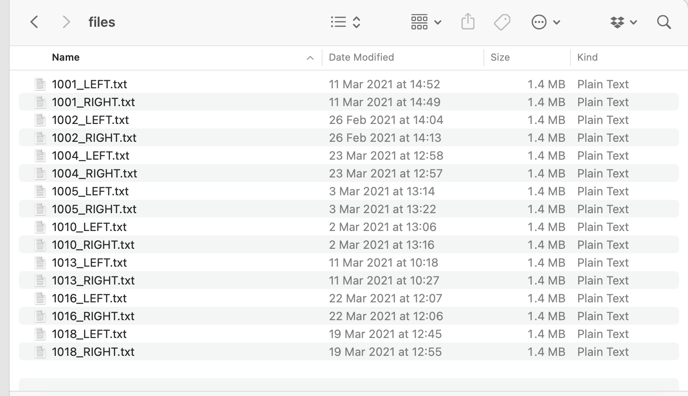
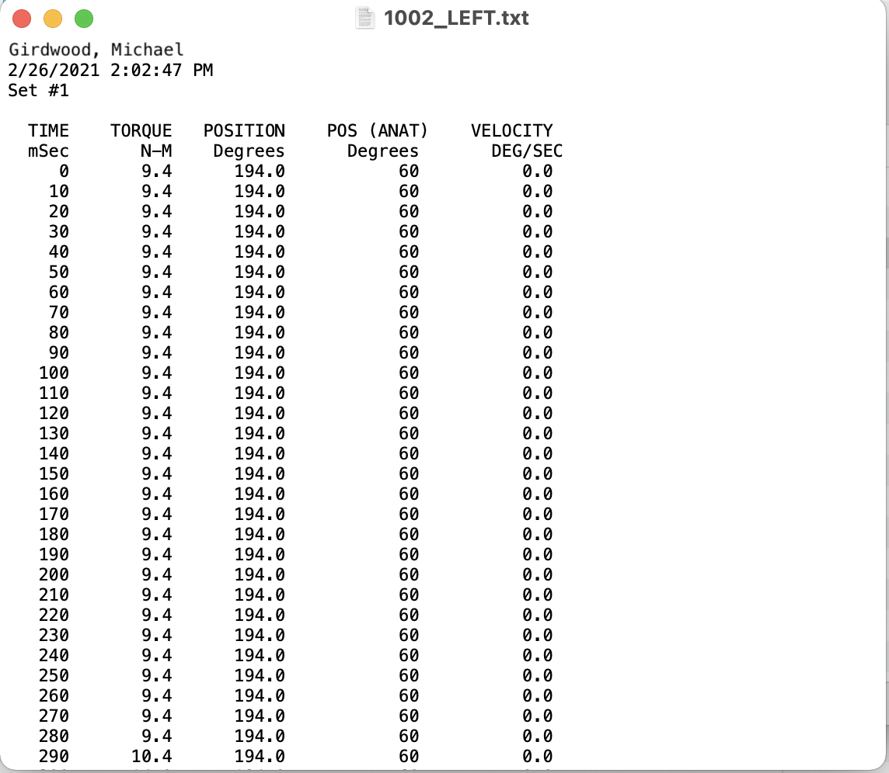

# The problem:

.pull-left-2[

A bunch of individual data files:



]
.pull-right-1[

<br>
<br>

Each with **28000** rows of data!


]

---

# Read all the files in

```{r echo = FALSE, warnings = FALSE, message=FALSE}
library(tidyverse)
```

Finding where the files are in the directory
```{r}
# Tell r where the files are

names <- list.files(path = "data/raw/files", 
        pattern = ".txt", recursive = TRUE) 

```

<br>
--

For each file in the location, read the file in:

```{r}

# For now don't worry too much about this

files <- names %>%
  paste0("data/raw/files/",.) %>% 
  map(~read.csv(., sep = "", skip = 5)) 
  
names(files) <- names %>% str_extract("\\w+")
```

---
## What each file now looks like...

.pull-left[

Before...


]

.pull-right[

... After 😎
```{r echo = FALSE}

file <- read.csv("data/raw/files/1001_LEFT.txt", sep = "", skip = 5) 
  head(file, n = 13) %>% knitr::kable(format = "html")
```
]
---

## Consolidate the data

Organise the files and calculate maximum statistics
```{r warnings = FALSE, message=FALSE}
# organising the files and calculating max statistics

data <- files %>%
  # for each file, calculate quad and hs max
  map(., ~(.x %>%
              summarise("quad_max" = max(N.M),
                        "hs_max" = min(N.M))))  %>% 
  
  # add a column containing the id of each file (filename)
  map2(., names(files), ~mutate(.x, id = .y)) %>%
  
  # combine all of the summaries together into one file
  map_df(~.x %>% nest(cols = -id)) %>%
  unnest

```

---
## Now we have this:
.pull-left[
```{r echo = FALSE}
head(data, n = 15) %>% knitr::kable(format = "html")
```
]

.pull-right[
#### Only problem:

The patient id and side are part of the same column 😔


]
---

## Simple problem:

Easy!

```{r eval = FALSE}

# Separate the id column into an "id" and "side" column
# Separate at the underscore

newdata <- data %>%
  separate(id, into = c("id", "side"), sep = "_")

```

--

```{r, echo = FALSE}
head(newdata) %>% knitr::kable(format = "html")
```

---

## Now for something more pratical:

Lets calculate the mean for all the columns in the table, for each side:

```{r eval = FALSE}
newdata %>%
  group_by(side) %>% # perform calculation for each side separately
  summarise(across(c(quad_max, hs_max), # nominate columns
            ~mean(.x))) # nominate function

```

--

```{r echo = FALSE}
newdata %>%
  group_by(side) %>% # perform calculation for each side separately
  summarise(across(c(quad_max, hs_max), # nominate columns
            ~mean(.x))) %>%
  mutate(hs_max = abs(hs_max)) %>% # nominate function
  knitr::kable(format = "html")
```

---

## A different example

Here is some different data:

.font60[
```{r echo = FALSE}
sidedata <- read.csv("sidedata.csv", header = TRUE)

head(sidedata) %>% knitr::kable(format = "html") 
```
]

<br>

.content-box[
Suppose I'm interested in looking at the **affected** and **non-affeted** sides instead of *left* and *right*]

---
## Example

```{r}

# Lets first change the data to "long form"
affecteddata <- sidedata %>%
  pivot_longer(cols = -c(id, gender, bmi, painside),
               names_to = "old_var",
               values_to = "value")
```

```{r echo = FALSE}
head(affecteddata, n = 10) %>% knitr::kable(format = "html")
```

---

```{r, echo=FALSE}

affecteddata <- affecteddata %>%
  separate(old_var, into = c("side", "variable"), sep = "_", extra = "merge", remove = TRUE) %>%
  mutate(side = case_when(
    side == "r" ~ "Right", 
    side == "l" ~ "Left"
  ))
  
affecteddata %>% knitr::kable(format = "html")
  
```  

---

## Now to change the side name

```{r}
affecteddata <- affecteddata %>%
  mutate(newvariable = case_when( # make a new variable
    painside == side ~ paste0("a_", variable), # if side matches = affected
    painside != side ~ paste0("c_", variable) # if different = contralateral
  ))
```

```{r echo = FALSE}

affecteddata %>% knitr::kable(format = "html")

```

---

## Now change it back to the wider format

```{r}

affecteddata <- affecteddata %>%
  select(-c(side, variable)) %>% # remove the old variables
  pivot_wider(id_cols = c(id, gender, bmi, painside),
              names_from = newvariable, # use the new variable #<<
              values_from = value)

```

<br>

```{r echo = FALSE}
head(affecteddata) %>% knitr::kable(format = "html")

```

---
## Efficiently running the same process

Model the effect of gender and bmi on leg lengths

```{r}
# first lets choose what variables we want to look at

variables <- c("a_thigh_length", "c_thigh_length", 
               "a_leg_length", "c_leg_length")

# Now lets specify what the model will look like:

variable_calls <- c(variables %>% paste(., "gender", sep = " ~ "), 
                    # gender models
                    variables %>% paste(., "bmi", sep = " ~ ")) 
                    # bmi models
```

Here is our list of models

.content-box[
```{r echo = FALSE}
variable_calls
```
]
---
# Time to run the models!

```{r}
models <- as.data.frame(variable_calls) %>%
  rename(call = 1) %>%
                   # for each call run  lm model
  mutate(summary = map(map(call, lm, data = affecteddata), 
                       # for each model provide a summary
                       broom::tidy)) %>% # 
  unnest(cols = summary)
```
--

```{r echo = FALSE} 
 head(models) %>% mutate_if(is.numeric, round, 2) %>% knitr::kable(format = "html")
```

---
class: inverse, center, middle


